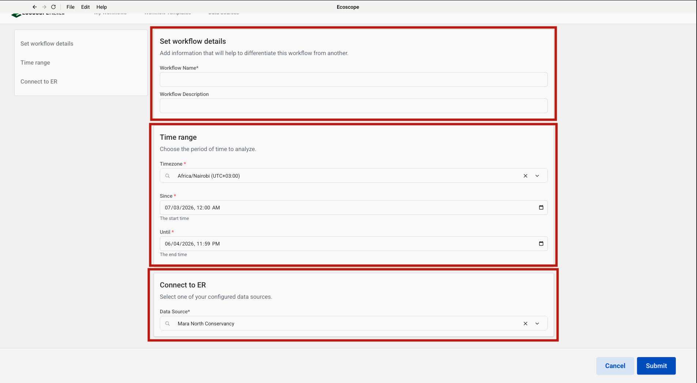

# MNC Wildlife Report — User Guide

This guide walks you through configuring and running the MNC Wildlife Report workflow, which processes elephant, buffalo, rhino, lion, leopard, cheetah, giraffe, hartebeest, and wildlife incident events from EarthRanger to produce tabular CSV reports, interactive maps, and herd-size charts.

---

## Overview

The workflow delivers, for each run:

**CSV tables**
- **total_elephants_events_recorded.csv** — daily count of unique elephant sighting events with a grand total row
- **total_buffalo_events_recorded.csv** — daily count of unique buffalo sighting events with a grand total row
- **total_rhino_events_recorded.csv** — daily count of unique rhino sighting events with a grand total row
- **total_lion_events_recorded.csv** — daily count of unique lion sighting events with a grand total row
- **individual_lions_summary.csv** — lion sightings grouped by pride
- **total_leopard_events_recorded.csv** — daily count of unique leopard sighting events with a grand total row
- **individual_leopard_summary.csv** — leopard sightings grouped by individuals present
- **total_cheetah_events_recorded.csv** — daily count of unique cheetah sighting events with a grand total row
- **individual_cheetah_summary.csv** — cheetah sightings grouped by individuals present
- **wildlife_events_recorded.csv** — raw wildlife incident records with all event fields
- **wildlife_incidents_summary_table.csv** — pivot table of wildlife incidents by type and date
- **wildlife_incidents_recorded_by_date.csv** — daily count of unique wildlife incident events with a grand total row

**Maps and charts (HTML + PNG)**
- **elephant_sightings_events** — point map of elephant sightings coloured by herd composition
- **elephant_herd_size_bar_chart** — bar chart of elephant herd size distribution across records
- **elephant_herd_types_map** — bubble map of elephant sightings sized by herd size (Blues colormap)
- **buffalo_sightings_events** — point map of buffalo sightings coloured by herd composition
- **buffalo_herd_size_bar_chart** — bar chart of buffalo herd size distribution across records
- **buffalo_herd_types_map** — bubble map of buffalo sightings sized by herd size (Blues colormap)
- **rhino_sightings_events** — point map of rhino sightings on conservancy boundaries and parcels
- **lion_sightings_events** — point map of lion sightings on conservancy boundaries and parcels
- **leopard_sightings_events** — point map of leopard sightings on conservancy boundaries and parcels
- **cheetah_sightings_events** — point map of cheetah sightings on conservancy boundaries and parcels
- **giraffe_sightings_events** — point map of giraffe sightings on conservancy boundaries and parcels
- **hartebeest_sightings_events** — point map of hartebeest sightings on conservancy boundaries and parcels
- **wildlife_incidents_map** — point map of wildlife incidents coloured by incident type

---

## Prerequisites

Before running the workflow, ensure you have:

- Access to an **EarthRanger** instance with sighting and incident events recorded for the analysis period (`elephant_sighting_rep`, `buffalo_sighting_rep`, `rhino_sighting_rep`, `lion_sighting_rep`, `leopardsightingrep`, `cheetah_sighting_rep`, `giraffe_sighting`, `hartebeest_sighting`, `snare_rep`, `fire_rep`, `wildlife_injury_rep`, `wildlife_treatment_rep`, `wildlife_carcass_rep`)
- Network access to **Dropbox** so the workflow can download the MNC conservancy boundary and parcels files at runtime

---

## Step-by-Step Configuration

### Step 1 — Add the Workflow Template

In the Ecoscope app, navigate to the **Workflow Templates** tab and click **Add Workflow Template** (top-right). In the **Github Link** field that appears, paste the repository URL:

```
https://github.com/wildlife-dynamics/mnc_wildlife_report.git
```

Then click **Add Template** to register the template.

---

### Step 2 — Configure the EarthRanger Connection

Navigate to **Data Sources** and click **Connect**. The **Connect Ecoscope to EarthRanger** dialog will open. Fill in the form:

| Field | Description |
|-------|-------------|
| Data Source Name | A label to identify this connection (e.g. `Mara North Conservancy`) |
| EarthRanger URL | Your instance URL (e.g. `your-site.pamdas.org`) |
| EarthRanger Username | Your EarthRanger username |
| EarthRanger Password | Your EarthRanger password |

> **Important:** Credentials entered here are **not** validated during setup. Any authentication errors will only appear when the workflow runs.

Click **Connect** to save the data source.


---

### Step 3 — Select the Workflow

Go back to **Workflow Templates**. The newly added template appears as the **mnc_wildlife_report** card (showing the source repository URL). Click the card to open the workflow configuration form.

---

### Step 4 — Configure Workflow Details, Time Range, and EarthRanger Connection

The configuration form is divided into three sections, each highlighted in the left-hand navigation panel.

**Set workflow details**

| Field | Description |
|-------|-------------|
| Workflow Name | A short name to identify this run (required) |
| Workflow Description | Optional notes to differentiate this run from others (e.g. reporting month or site) |

**Time range**

| Field | Description |
|-------|-------------|
| Timezone | Select the local timezone (e.g. `Africa/Nairobi (UTC+03:00)`) |
| Since | Start date and time — all wildlife events from this point are fetched |
| Until | End date and time of the analysis window |

**Connect to ER**

Select the EarthRanger data source configured in Step 2 from the **Data Source** dropdown (e.g. `Mara North Conservancy`).

Once all three sections are filled, click **Submit** to start the workflow.



---

## Running the Workflow

Once submitted, the runner will:

1. Download the MNC community conservancy boundary and parcels files from Dropbox and prepare all geospatial map layers (conservancy boundaries, parcels, and conservancy text labels). Compute a global map zoom level from the overall grazing zones extent.
2. Fetch all 13 event types from EarthRanger for the analysis period; extract the date from each event's timestamp; add a temporal index.
3. **Elephant branch** — filter `elephant_sighting_rep` events; resolve field IDs to display titles; normalise and flatten event details; retain herd composition, herd size, and demographic columns (female, male, sub-adult, under a year); replace missing herd composition with Unspecified; count unique events per day with a grand total row and save as `total_elephants_events_recorded.csv`; produce a herd-composition point map saved as `elephant_sightings_events.html` and `.png`; bin herd sizes into 7 intervals and produce a bar chart saved as `elephant_herd_size_bar_chart.html` and `.png`; produce a bubble map sized by herd size saved as `elephant_herd_types_map.html` and `.png`.
4. **Buffalo branch** — filter `buffalo_sighting_rep` events; resolve field IDs to display titles; normalise and flatten event details; retain herd composition and herd size; replace missing herd composition with Unspecified; count unique events per day with a grand total row and save as `total_buffalo_events_recorded.csv`; produce a herd-composition point map saved as `buffalo_sightings_events.html` and `.png`; bin herd sizes into 7 intervals and produce a bar chart saved as `buffalo_herd_size_bar_chart.html` and `.png`; produce a bubble map sized by herd size saved as `buffalo_herd_types_map.html` and `.png`.
5. **Rhino branch** — filter `rhino_sighting_rep` events; resolve field IDs to display titles; normalise and flatten event details; count unique events per day with a grand total row and save as `total_rhino_events_recorded.csv`; produce a point map saved as `rhino_sightings_events.html` and `.png`.
6. **Lion branch** — filter `lion_sighting_rep` events; resolve field IDs to display titles; normalise and flatten event details; count unique events per day with a grand total row and save as `total_lion_events_recorded.csv`; produce a pride-grouped individual summary and save as `individual_lions_summary.csv`; produce a point map saved as `lion_sightings_events.html` and `.png`.
7. **Leopard branch** — filter `leopardsightingrep` events; resolve field IDs to display titles; normalise and flatten event details; count unique events per day with a grand total row and save as `total_leopard_events_recorded.csv`; produce an individual identity summary grouped by individuals present and save as `individual_leopard_summary.csv`; produce a point map saved as `leopard_sightings_events.html` and `.png`.
8. **Cheetah branch** — filter `cheetah_sighting_rep` events; resolve field IDs to display titles; normalise and flatten event details; count unique events per day with a grand total row and save as `total_cheetah_events_recorded.csv`; produce an individual identity summary grouped by individuals present and save as `individual_cheetah_summary.csv`; produce a point map saved as `cheetah_sightings_events.html` and `.png`.
9. **Giraffe branch** — filter `giraffe_sighting` events; resolve field IDs to display titles; normalise and flatten event details; produce a point map saved as `giraffe_sightings_events.html` and `.png`.
10. **Hartebeest branch** — filter `hartebeest_sighting` events; resolve field IDs to display titles; normalise and flatten event details; produce a point map saved as `hartebeest_sightings_events.html` and `.png`.
11. **Wildlife incidents branch** — filter `snare_rep`, `fire_rep`, `wildlife_injury_rep`, `wildlife_treatment_rep`, and `wildlife_carcass_rep` events; normalise event details; rename raw field keys to human-readable column names; save the full records as `wildlife_events_recorded.csv`; produce a pivot summary table by incident type and save as `wildlife_incidents_summary_table.csv`; count unique incidents per day with a grand total row and save as `wildlife_incidents_recorded_by_date.csv`; produce a point map coloured by incident type saved as `wildlife_incidents_map.html` and `.png`.
12. Save all outputs to the directory specified by `ECOSCOPE_WORKFLOWS_RESULTS`.

---

## Output Files

All outputs are written to `$ECOSCOPE_WORKFLOWS_RESULTS/`.

### CSV Tables

| File | Description |
|------|-------------|
| `total_elephants_events_recorded.csv` | Daily unique elephant sighting count (date, no_of_events) with a grand Total row |
| `total_buffalo_events_recorded.csv` | Daily unique buffalo sighting count (date, no_of_events) with a grand Total row |
| `total_rhino_events_recorded.csv` | Daily unique rhino sighting count (date, no_of_events) with a grand Total row |
| `total_lion_events_recorded.csv` | Daily unique lion sighting count (date, no_of_events) with a grand Total row |
| `individual_lions_summary.csv` | Lion sightings grouped by pride |
| `total_leopard_events_recorded.csv` | Daily unique leopard sighting count (date, no_of_events) with a grand Total row |
| `individual_leopard_summary.csv` | Leopard sightings grouped by individuals present |
| `total_cheetah_events_recorded.csv` | Daily unique cheetah sighting count (date, no_of_events) with a grand Total row |
| `individual_cheetah_summary.csv` | Cheetah sightings grouped by individuals present |
| `wildlife_events_recorded.csv` | Raw wildlife incident records with all event fields |
| `wildlife_incidents_summary_table.csv` | Pivot table of incident counts by type (Fire, Snare, Wildlife carcass, Injured wildlife, Veterinary treatment) |
| `wildlife_incidents_recorded_by_date.csv` | Daily unique wildlife incident count (date, no_of_events) with a grand Total row |

### Maps and Charts

| File | Description |
|------|-------------|
| `elephant_sightings_events.html` / `.png` | Elephant sighting locations coloured by herd composition |
| `elephant_herd_size_bar_chart.html` / `.png` | Bar chart of elephant herd size frequency distribution |
| `elephant_herd_types_map.html` / `.png` | Bubble map of elephant sightings; point radius proportional to herd size |
| `buffalo_sightings_events.html` / `.png` | Buffalo sighting locations coloured by herd composition |
| `buffalo_herd_size_bar_chart.html` / `.png` | Bar chart of buffalo herd size frequency distribution |
| `buffalo_herd_types_map.html` / `.png` | Bubble map of buffalo sightings; point radius proportional to herd size |
| `rhino_sightings_events.html` / `.png` | Rhino sighting locations on conservancy boundaries and parcels |
| `lion_sightings_events.html` / `.png` | Lion sighting locations on conservancy boundaries and parcels |
| `leopard_sightings_events.html` / `.png` | Leopard sighting locations on conservancy boundaries and parcels |
| `cheetah_sightings_events.html` / `.png` | Cheetah sighting locations on conservancy boundaries and parcels |
| `giraffe_sightings_events.html` / `.png` | Giraffe sighting locations on conservancy boundaries and parcels |
| `hartebeest_sightings_events.html` / `.png` | Hartebeest sighting locations on conservancy boundaries and parcels |
| `wildlife_incidents_map.html` / `.png` | Wildlife incident locations coloured by incident type |
